<div align="center">


<h1>Runbook Automation Platform</h1>

<p><strong>The Strategic SRE Architecture for Defining, Executing, and Optimizing Operational Workflows and Automated Remediation</strong></p>

[]()
[]()
[]()

<br/>

> **"If you have to do it more than twice, automate it."** 
> Runbook Automation (Runbook-AI) is an enterprise-grade platform designed to provide a secure, measurable, and highly automated foundation for operational excellence. It orchestrates the complex lifecycle of operational runbooks—from manual maintenance tasks to event-driven incident response. By providing a standardized execution engine with conditional logic, plugin-based actions, and multi-step workflow orchestration, it enables organizations to eliminate operational toil, reduce MTTR, and ensure consistent execution across every tier of the infrastructure.

</div>

---

## 🏛️ Executive Summary

Operational efficiency is often hampered by "tribal knowledge" and manual, error-prone remediation steps. Organizations fail to scale their SRE practices because their runbooks are static documents rather than executable code.

This platform provides the **Operational Control Plane**. It implements a complete **Automation Intelligence Framework**—from YAML-based runbook definitions to asynchronous execution workers and plugin-driven integrations. By operationalizing runbook execution, it ensures that your maintenance and response strategies are not just documented, but executed with precision, audited for compliance, and optimized for maximum uptime.

---

## 🏛️ Core Automation Pillars

1. **Executable Runbook Model**: Transition from static PDF/Wiki runbooks to dynamic, step-based executable workflows with conditional "if-this-then-that" logic.
2. **High-Fidelity Execution Engine**: Asynchronous task orchestration with built-in retry mechanisms, timeout management, and parallel step execution.
3. **Plugin Action Architecture**: Extensible plugin system for API calls, shell commands, database queries, and multi-channel notifications (Slack, PagerDuty).
4. **Event-Driven Remediation**: Auto-triggering of specific runbooks based on monitoring alerts or system events to achieve "Zero-Touch" incident response.
5. **Governance & Approval Gateway**: Integrated approval steps for sensitive operational actions, ensuring that high-risk automations require human oversight.
6. **Operational Observability**: Real-time tracking of execution success rates, duration metrics, and centralized logging for comprehensive post-mortem analysis.

---

## 📐 Architecture Storytelling: 50+ Advanced Diagrams

### 1. The Automation Lifecycle
*The flow from incident detection to automated resolution.*
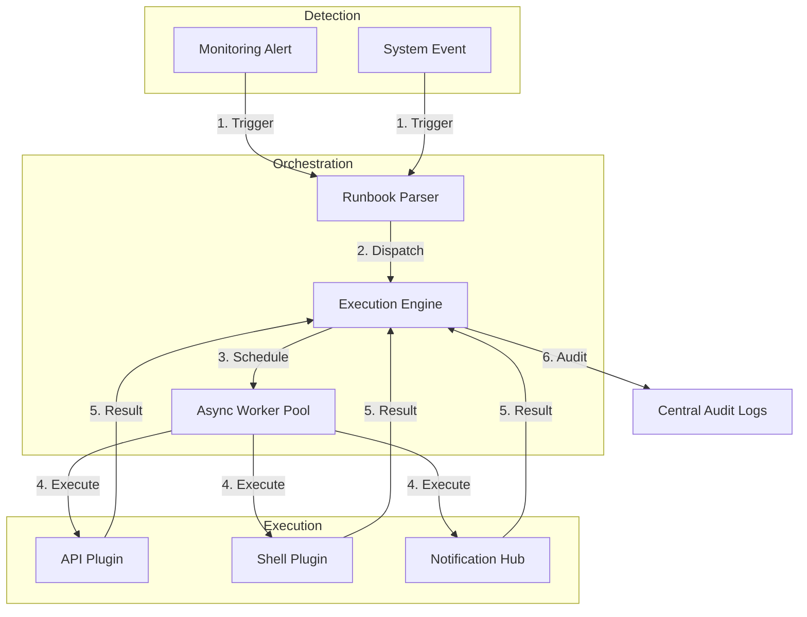

### 2. Multi-Step Workflow Graph
*Orchestrating complex dependencies and parallel execution.*
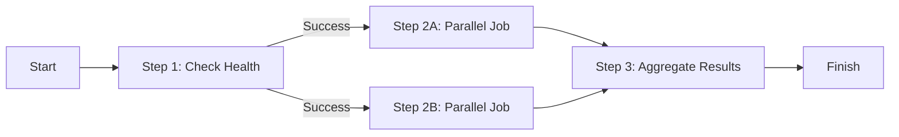

### 3. Conditional Execution Logic
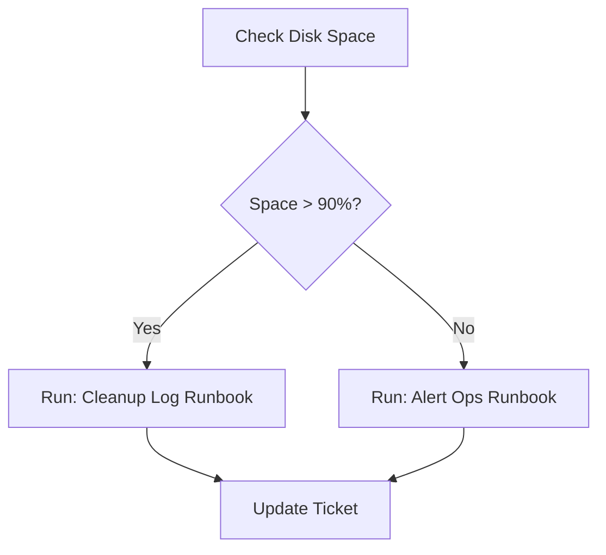

### 4. Runbook Plugin Architecture
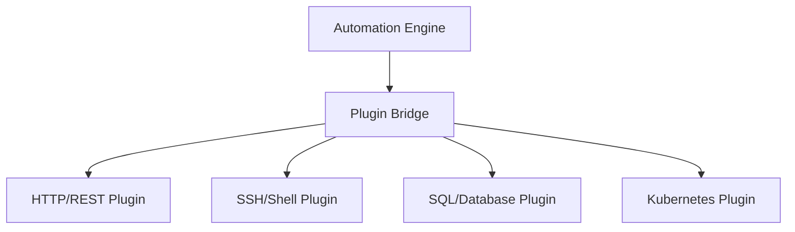

### 5. Deployment Topology: High Availability Automation
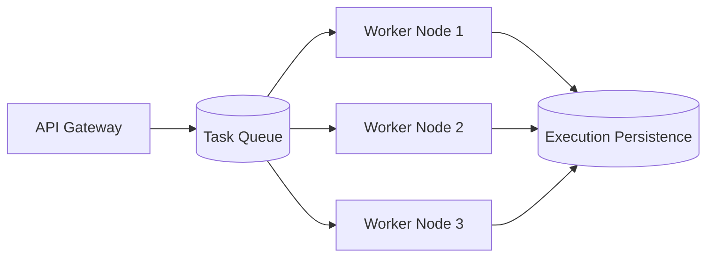

### 6. Runbook State Machine
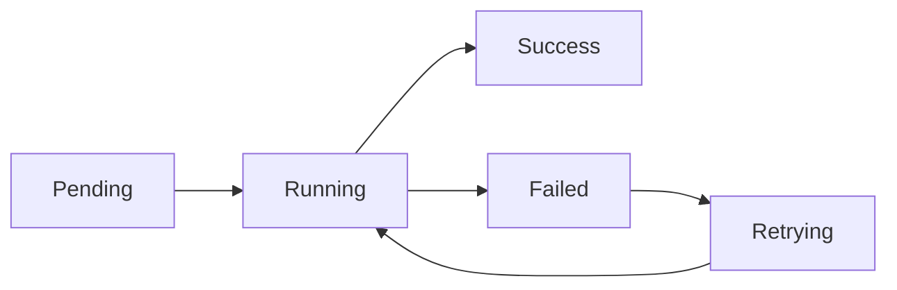

### 7. Foundation: Multi-Environment Setup
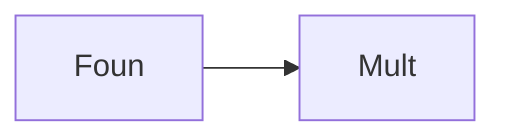

### 8. Networking: Secure Automation Tunnels
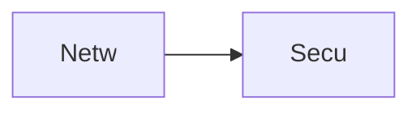

### 9. Component: Runbook Engine
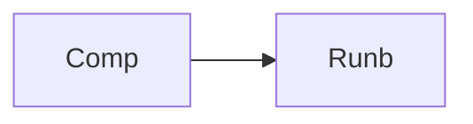

### 10. Component: Execution Worker
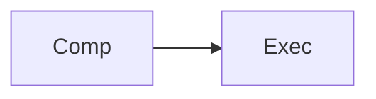

### 11. Component: Plugin Hub
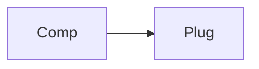

### 12. Component: Orchestration Engine
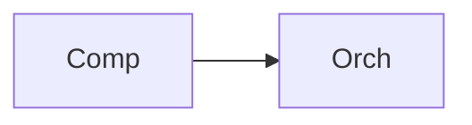

### 13. Logic: Step Retry Handler
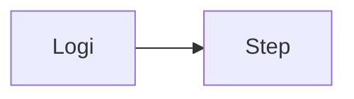

### 14. Logic: Conditional Branching
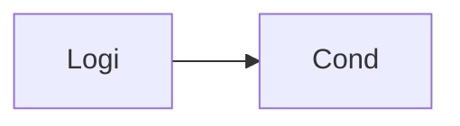

### 15. Logic: Approval Workflow
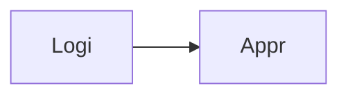

### 16. Logic: Event Trigger Mapper
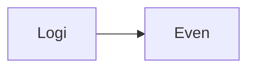

### 17. Architecture: Central Automation Hub
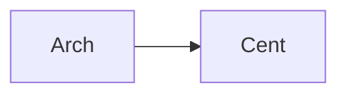

### 18. Architecture: Distributed Worker Pool
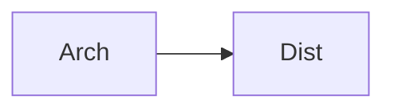

### 19. Architecture: Real-time Audit Lake
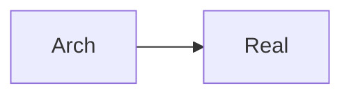

### 20. Pattern: Automation-as-Code
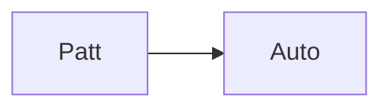

### 21. Pattern: Self-Healing Systems
```mermaid
graph LR
    P[Patt] --> S[Self]
```

### 22. Pattern: Governance-by-Design
```mermaid
graph LR
    P[Patt] --> G[Gove]
```

### 23. Security: Encrypted Secrets Store
```mermaid
graph LR
    S[Secu] --> E[Encr]
```

### 24. Security: Identity-based Execution
```mermaid
graph LR
    S[Secu] --> I[Iden]
```

### 25. Security: Secure Audit Trail
```mermaid
graph LR
    S[Secu] --> S[Secu]
```

### 26. Feature: YAML Runbook Parser
```mermaid
graph LR
    F[Feat] --> Y[YAML]
```

### 27. Feature: Step Duration Heatmap
```mermaid
graph LR
    F[Feat] --> S[Step]
```

### 28. Feature: Interactive Workflow Builder
```mermaid
graph LR
    F[Feat] --> I[Inte]
```

### 29. Compliance: SOC2 Automation Log
```mermaid
graph LR
    C[Comp] --> S[SOC2]
```

### 30. Compliance: Role-based Approvals
```mermaid
graph LR
    C[Comp] --> R[Role]
```

### 31. Infrastructure: Redis Task Broker
```mermaid
graph LR
    I[Infr] --> R[Redi]
```

### 32. Infrastructure: Postgres Execution DB
```mermaid
graph LR
    I[Infr] --> P[Post]
```

### 33. Deployment: Kubernetes Worker Pods
```mermaid
graph LR
    D[Depl] --> K[Kube]
```

### 34. Deployment: Multi-Region Hub Sync
```mermaid
graph LR
    D[Depl] --> M[Mult]
```

### 35. Monitoring: Automation Success KPI
```mermaid
graph LR
    M[Moni] --> A[Auto]
```

### 36. Monitoring: Plugin Performance
```mermaid
graph LR
    M[Moni] --> P[Plug]
```

### 37. UI: Runbook Library View
```mermaid
graph LR
    U[UI] --> R[Runb]
```

### 38. UI: Execution Details Pane
```mermaid
graph LR
    U[UI] --> E[Exec]
```

### 39. UI: Workflow Visualizer
```mermaid
graph LR
    U[UI] --> W[Work]
```

### 40. UI: Governance Scorecard
```mermaid
graph LR
    U[UI] --> G[Gove]
```

### 41. CI/CD: Automation code build pipeline
```mermaid
graph LR
    C[CICD] --> A[Auto]
```

### 42. CI/CD: Runbook validation pipeline
```mermaid
graph LR
    C[CICD] --> R[Runb]
```

### 43. Strategy: Toil Reduction Focus
```mermaid
graph LR
    S[Stra] --> T[Toil]
```

### 44. Strategy: Mean-Time-To-Automate
```mermaid
graph LR
    S[Stra] --> M[Mean]
```

### 45. Feature: Auto-generated Post-mortems
```mermaid
graph LR
    F[Feat] --> A[Auto]
```

### 46. Feature: Step Parallelization Engine
```mermaid
graph LR
    F[Feat] --> S[Step]
```

### 47. Feature: Rollback Runbook Support
```mermaid
graph LR
    F[Feat] --> R[Roll]
```

### 48. Logic: Dependency Resolver
```mermaid
graph LR
    L[Logi] --> D[Depe]
```

### 49. Data Model: Runbook Execution Entity
```mermaid
graph LR
    D[Data] --> R[Runb]
```

### 50. Enterprise Automation Excellence
```mermaid
graph LR
    E[Entr] --> A[Auto]
```

---

## 🛠️ Technical Stack & Implementation

### Automation Engine & APIs
- **Framework**: Python 3.11+ / FastAPI.
- **Runbook Engine**: Step-based execution with conditional logic and retries.
- **Plugin System**: Extensible architecture for multi-channel action execution.
- **Workflow Engine**: Orchestrates multi-runbook dependencies and state.
- **Cache**: Redis for high-speed task brokering and execution state.
- **Persistence**: PostgreSQL for runbook definitions, execution history, and audit logs.
- **Identity**: OIDC / JWT with RBAC for granular automation access.

### Frontend (Automation Dashboard)
- **Framework**: React 18 / Vite.
- **Theme**: Dark Blue / Amber (Modern Operational aesthetic).
- **Visualization**: Recharts for execution trends and plugin usage metrics.

### Infrastructure
- **Runtime**: AWS EKS (Kubernetes).
- **Deployment**: Helm charts for engines and worker distributions.
- **IaC**: Terraform (Modular with Automation focus).

---

## 🚀 Deployment Guide

### Local Development
```bash
# Clone the repository
git clone https://github.com/devopstrio/runbook-automation.git
cd runbook-automation

# Setup environment
cp .env.example .env

# Launch the Automation stack (API, Workers, DB, Redis, UI)
make up

# Execute a sample incident response runbook
make execute-runbook
```
Access the Automation Dashboard at `http://localhost:3000`.

---

## 📜 License
Distributed under the MIT License. See `LICENSE` for more information.
