<div align="center">


<h1>Runbook Automation Platform</h1>

<p><strong>The Strategic SRE Architecture for Defining, Executing, and Optimizing Operational Workflows and Automated Remediation.</strong></p>

[]()
[]()
[]()

<br/>

> **"If you have to do it more than twice, automate it."** 
> **Runbook Automation (Runbook-AI)** is an enterprise-grade platform designed to provide a secure, measurable, and highly automated foundation for operational excellence. It orchestrates the entire lifecycle—from manual maintenance tasks to event-driven, self-healing incident response.

</div>

---

## 🏛️ Executive Summary

Operational efficiency is often hampered by "tribal knowledge" and manual, error-prone remediation steps. Organizations often fail to scale their SRE practices because their operational runbooks are static documents rather than executable, version-controlled code, leading to increased MTTR and operational toil.

This platform provides the **Operational Control Plane**. It implements a complete **Automation Intelligence Framework**, enabling SRE and Platform Engineering teams to manage operational procedures as a first-class citizen. By automating the execution of complex workflows and the orchestration of cross-cloud actions, we ensure that every operational task is executed with precision, audited for compliance, and optimized for maximum system uptime.

---

## 📐 Architecture Storytelling: Principal Reference Models

### 1. Principal Architecture: Global Runbook Automation & Operational Orchestration Plane
This diagram illustrates the end-to-end flow from multi-source incident triggers to runbook parsing, asynchronous execution, and forensic audit logging.

```mermaid
graph LR
    %% Subgraph Definitions
    subgraph TriggerSource["Incident & Event Sources"]
        direction TB
        Alerts["Monitoring Alerts (Prometheus/DataDog)"]
        Events["System Events (CloudWatch/EventBridge)"]
        Manual["Self-Service UI (ServiceNow/Port)"]
    end

    subgraph IntelligenceEngine["Automation Intelligence Hub"]
        direction TB
        API["FastAPI Orchestration Gateway"]
        Parser["YAML Runbook Parser"]
        Logic["Conditional Logic Engine"]
        Registry["Global Runbook Library"]
    end

    subgraph ExecutionPlane["Multi-Cloud Execution Hub"]
        direction TB
        AWS["AWS Systems Manager (SSM)"]
        Azure["Azure Automation Runbooks"]
        Ansible["Ansible / Terraform Workers"]
        K8s["Kubernetes Jobs / CronJobs"]
    end

    subgraph UserInterface["Institutional Ops Interface"]
        direction TB
        Approval["Human-in-the-loop Approval"]
        Visualizer["Workflow Execution Visualizer"]
        Scorecard["MTTR & Automation Scorecard"]
    end

    subgraph DevOps["Orchestrator-as-Code Orchestration"]
        direction TB
        GitOps["GitOps Runbook Sync"]
        TF["Terraform Automation Modules"]
        Lake["Forensic Automation Lake"]
    end

    %% Flow Arrows
    TriggerSource -->|1. Trigger Event| API
    API -->|2. Resolve Runbook| Registry
    Registry -->|3. Parse Definition| Parser
    Parser -->|4. Execute Logic| Logic
    
    Logic -->|5. High-Impact Approval| Approval
    Approval -->|6. Authorize| ExecutionPlane
    ExecutionPlane -->|7. Execute Action| ExecutionPlane
    
    API -->|8. Visualize Status| Visualizer
    Visualizer -->|9. Aggregate KPI| Scorecard
    
    GitOps -->|10. Update Runbooks| API
    TF -->|11. Provision Hub| IntelligenceEngine
    API -->|12. Archive Execution| Lake

    %% Styling
    classDef trigger fill:#f5f5f5,stroke:#616161,stroke-width:2px;
    classDef intel fill:#ede7f6,stroke:#311b92,stroke-width:2px;
    classDef execute fill:#e3f2fd,stroke:#0d47a1,stroke-width:2px;
    classDef ui fill:#e8f5e9,stroke:#1b5e20,stroke-width:2px;
    classDef devops fill:#fffde7,stroke:#f57f17,stroke-width:2px;

    class TriggerSource trigger;
    class IntelligenceEngine intel;
    class ExecutionPlane execute;
    class UserInterface ui;
    class DevOps devops;
```

### 2. The Automation Lifecycle Management Flow
The continuous path of an operational task from initial trigger and triage to secure execution and forensic auditing.

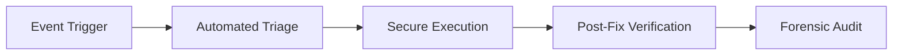

### 3. Self-Healing Closed-Loop Orchestration
Building autonomous systems that detect issues and automatically trigger remediation runbooks to resolve them without human intervention.

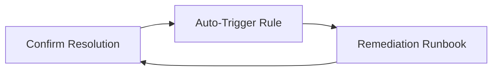

### 4. Multi-Cloud Execution Hub
Standardizing operational actions across diverse cloud environments using a unified execution interface.

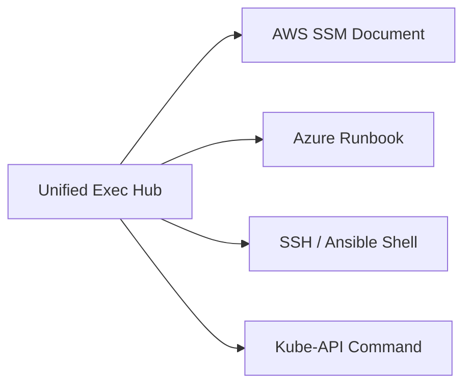

### 5. Runbook-as-Code (YAML/HCL) Flow
Version-controlling operational procedures to ensure consistency, auditability, and peer review of all automation.

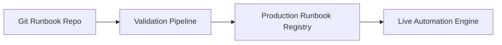

### 6. Conditional Logic & Branching Engine
Implementing complex "if-this-then-that" decision trees within runbooks to handle varying failure scenarios.

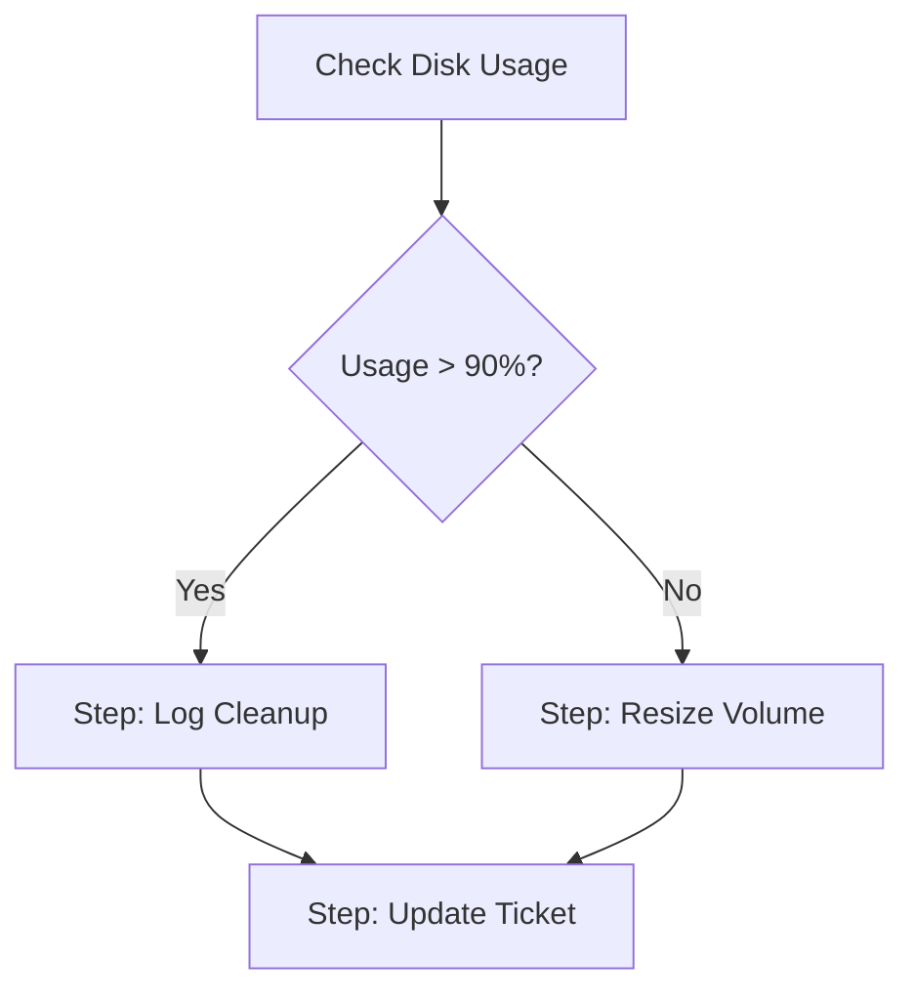

### 7. Interactive Workflow (Human-in-the-loop)
Ensuring safety by implementing mandatory approval gates for high-impact or destructive operational actions.

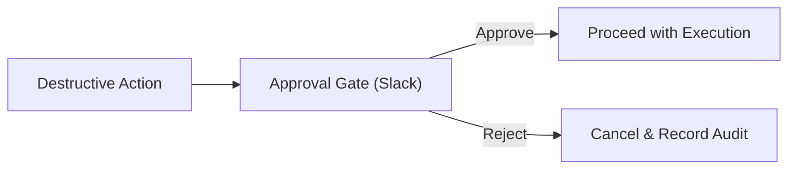

### 8. Identity & RBAC for Ops Governance
Managing fine-grained execution permissions based on organizational roles and service ownership.

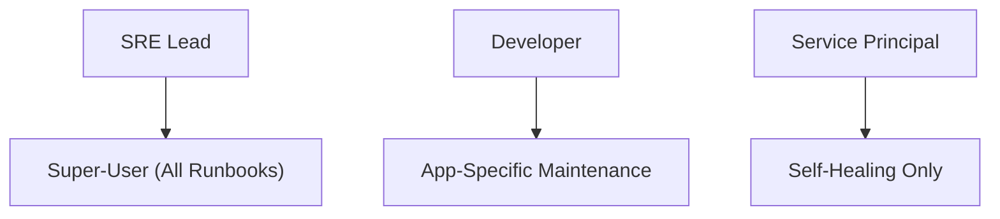

### 9. Operational Scorecard & MTTR Analytics
Measuring the institutional impact of automation on system reliability and mean-time-to-resolution.

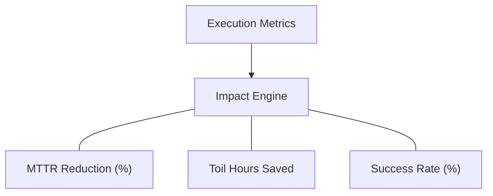

### 10. IaC Deployment: Orchestrator-as-Code Framework
Using Terraform to deploy and manage the lifecycle of the runbook automation infrastructure.

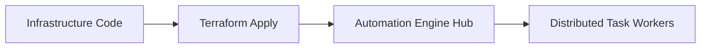

### 11. Metadata Lake for Forensic Automation Audit
Storing long-term records of every automated action, output, and result for institutional auditing.

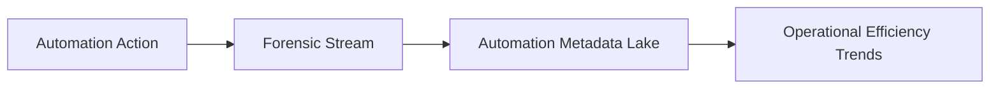

---

## 🏛️ Core Automation Pillars

1.  **Executable Runbook Model**: Transition from static documentation to dynamic, step-based executable workflows.
2.  **High-Fidelity Execution Engine**: Asynchronous task orchestration with built-in retries and parallel step execution.
3.  **Plugin Action Architecture**: Extensible system for API calls, shell commands, and multi-channel notifications.
4.  **Event-Driven Remediation**: Auto-triggering of runbooks based on monitoring alerts for "Zero-Touch" response.
5.  **Governance & Approval Gateway**: Integrated approval steps for high-risk actions ensuring human oversight.
6.  **Operational Observability**: Real-time tracking of success rates and duration metrics for performance analysis.

---

## 🛠️ Technical Stack & Implementation

### Automation Engine & APIs
*   **Framework**: Python 3.11+ / FastAPI.
*   **Runbook Engine**: YAML-based execution engine with conditional logic and stateful step tracking.
*   **Plugin Hub**: Extensible action library for cloud APIs (AWS/Azure/GCP), SSH, and Kubernetes.
*   **Workflow Engine**: Orchestrates multi-runbook dependencies and parallel task distribution.
*   **State Management**: PostgreSQL (Metadata Lake) and Redis (Task Queue).

### Automation Dashboard (UI)
*   **Framework**: React 18 / Vite.
*   **Theme**: Dark Blue / Amber (Modern Operational Excellence aesthetic).
*   **Visualization**: Recharts for execution trends and MTTR reduction analytics.

### Infrastructure & DevOps
*   **Runtime**: AWS EKS or Azure Kubernetes Service (AKS).
*   **IaC**: Modular Terraform for deploying the orchestrator hub and worker distributions.

---

## 🏗️ IaC Mapping (Module Structure)

| Module | Purpose | Real Services |
| :--- | :--- | :--- |
| **`infrastructure/orchestrator`** | Central management plane | EKS, PostgreSQL, Redis |
| **`infrastructure/workers`** | Distributed task execution | Lambda, Fargate, Spot Nodes |
| **`infrastructure/integrations`** | Multi-channel communication | SES, Slack API, PagerDuty |
| **`infrastructure/auditing`** | Forensic execution logging | RDS, S3 Glacier, Athena |

---

## 🚀 Deployment Guide

### Local Principal Environment
```bash
# Clone the automation platform
git clone https://github.com/devopstrio/runbook-automation.git
cd runbook-automation

# Configure environment
cp .env.example .env

# Launch the Automation stack
make up

# Execute a sample incident response runbook
make execute-runbook name="disk-cleanup"
```

Access the Runbook Automation Dashboard at `http://localhost:3000`.

---

## 📜 License
Distributed under the MIT License. See `LICENSE` for more information.

---
<div align="center">
  <p>© 2026 Devopstrio. All rights reserved.</p>
</div>
